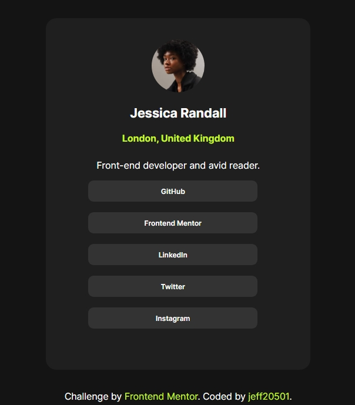

## Table of contents

- [Overview](#overview)
  - [The challenge](#the-challenge)
- [My process](#my-process)
  - [Built with](#built-with)
  - [What I learned](#what-i-learned)
  - [Useful resources](#useful-resources)
- [Author](#author)
- [Acknowledgments](#acknowledgments)


## Overview
I created a Social Links Profile Page, inspired by a Frontend Mentor challenge. The page displays a profile image, name, location, a short bio, and a list of social buttons that trigger JavaScript alerts when clicked

### The challenge
One of the main challenges was deciding how to structure the buttons. I wasn’t sure whether to use <ul>, <p>, or another element. After some thought, I chose <ul> with <li> items because it allowed easier styling and semantic grouping of link.


### screenshot




## My process
This small project helped me reinforce core HTML, CSS, and JavaScript concepts while building something visually appealing and interactive. I also practiced thinking about UX (user experience) and maintaining clean, maintainable code.

### Built with

-HTML: Structured the page semantically using elements like ```<section>, <ul>, <li>, and <button>.```

CSS: Applied custom styling with modern design principles, including flexbox-like centering, hover effects, rounded buttons, and color schemes inspired by dark-mode UIs.

JavaScript: Used simple inline onclick event handlers to add interactive feedback (alerts) when buttons are clicked.

Design approach: Focused on minimalism and clarity, ensuring good alignment, spacing, and consistency throughout the page.


### What I learned

Use this section to recap over some of your major learnings while working through this project. Writing these out and providing code samples of areas you want to highlight is a great way to reinforce your own knowledge.

To see how you can add code snippets, see below:

```html
<h1>Some HTML code I'm proud of</h1>
```
```css
.proud-of-this-css {
  color: papayawhip;
}
```
```js
const proudOfThisFunc = () => {
  console.log('🎉')
}
```


### Useful resources

- [Example resource buttons W3schools](https://www.w3schools.com/tags/tag_button.asp) - This helped me wit the buttons. I really liked this pattern and will use it going forward.


## Author

- Frontend Mentor - [jeff20501](https://www.frontendmentor.io/profile/jeff20501)
- Github - [jeff20501](https://github.com/jeff20501)


## Acknowledgments
Big thanks to W3Schools for helpful resources on buttons and CSS techniques

